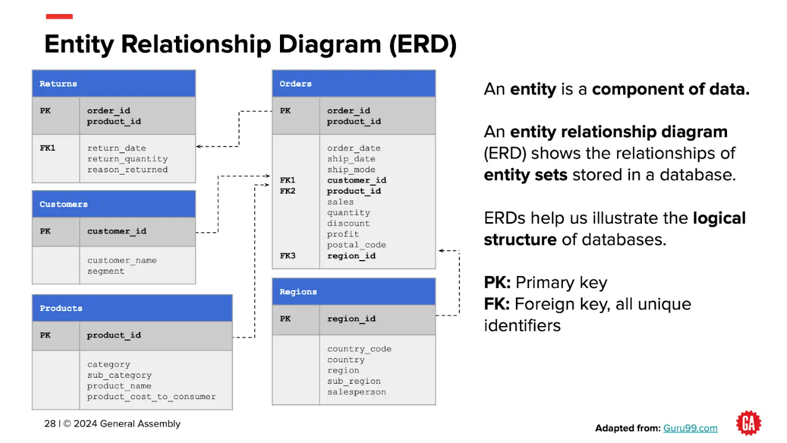

# 📂 Module 01: SQL & Relational Databases

Welcome to the SQL module repository! This section covers relational database querying, data transformations, multi-table joins, and subqueries using **Google BigQuery** standard SQL.

---

## 🗄️ Dataset & ERD

All queries target the store under `dab4pt.store`. _Note: You need to upload the data manually in Google BigQuery._

* **`orders`**: Core sales transactions, profits, and shipping details.
* **`products`**: Item catalog, categories, and costs.
* **`customers`**: Customer profiles and IDs.
* **`regions`**: Geographic mappings and assigned sales reps.
* **`returns`**: Order return logs and quantities.

---

## 🎯 Main Concepts Taught

1. **Basic Querying & Filtering:** Standard selection (`SELECT`), deduplication (`DISTINCT`), sorting (`ORDER BY`), and pattern filtering (`WHERE`, `LIKE`, `IN`).
2. **Conditional Logic:** Categorizing data using `CASE WHEN`.
3. **Date & Time Operations:** Extracting date parts (`EXTRACT`) and truncating dates (`DATE_TRUNC`).
4. **Aggregations & Grouping:** Summary calculations (`SUM`, `AVG`, `COUNT`) with `GROUP BY` and post-filter `HAVING`.
5. **Relational Joins:** Linking tables via `INNER JOIN` and finding non-matching records via `LEFT JOIN`.
6. **Subqueries & String Operations:** Nested queries for comparative logic and string functions (`CONCAT`, `SPLIT`).

---

## 📂 Class Files Breakdown

| Date / File | Key Focus Areas |
| :--- | :--- |
| **`21-July.txt`** | basic selection, `DISTINCT`, sorting (`ORDER BY`), limit outputs, wildcard pattern matching (`LIKE`) |
| **`22-July.txt`** | compound conditions (`AND`/`OR`/`NOT`), `CASE WHEN` logic, handling `NULL` values |
| **`26-July.txt`** | date filtering, `EXTRACT()`, `DATE_TRUNC()`, basic aggregations (`SUM`, `AVG`) with `GROUP BY` |
| **`27-July.txt`** | `HAVING` clause filtering, introductory `INNER JOIN` across tables |
| **`28-July.txt`** | `LEFT JOIN` applications, multi-table joins, subqueries in the `FROM` clause |
| **`29-July.txt`** | scalar/list subqueries in `WHERE`/`HAVING`, string manipulation (`CONCAT`, `SPLIT`) |
