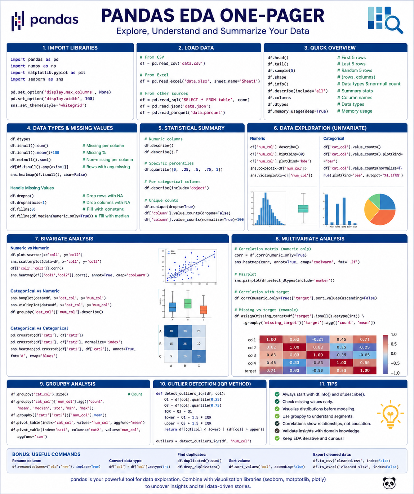

# 📂 Lesson 05: Introduction to Pandas

## 🎯 Learning Objectives & Notebook Summary

Based on the `pandas-dsb4.ipynb` walkthrough, this lesson covers the complete foundational workflow for handling tabular data:

*   **Environment Setup:** Installing necessary packages (`pandas`, `matplotlib`, `plotly`, `openpyxl`) and importing them into your environment.
*   **Data Ingestion:** Reading external datasets using `pd.read_csv()` and `pd.read_excel()`. It also covers troubleshooting common read errors, such as using `encoding='unicode_escape'` for encoding issues.
*   **Data Inspection & Summary:** Getting a high-level overview of your DataFrame using essential methods like `.head()`, `.tail()`, `.info()`, `.describe()`, `.shape`, and `.columns`.
*   **Data Selection & Slicing:** Extracting specific data by selecting single columns (`df['col']`), multiple columns (`df[['col1', 'col2']]`), and slicing rows by index (`df[0:5]`).
*   **Data Type Casting:** Checking data types with `.dtypes` and properly casting them using `.astype()` (e.g., converting to `Int64`) and parsing dates with `pd.to_datetime()`.
*   **Datetime Operations:** Using the `.dt` accessor to extract specific temporal features from datetime columns (like `.dt.year`, `.dt.month`, or `.dt.day_name()`).
*   **Column & Row Management:** Creating new columns, renaming existing ones with `.rename()`, and removing data safely using `.drop()` (for rows and columns) or the `del` command.

## Cheatsheet of pandas

